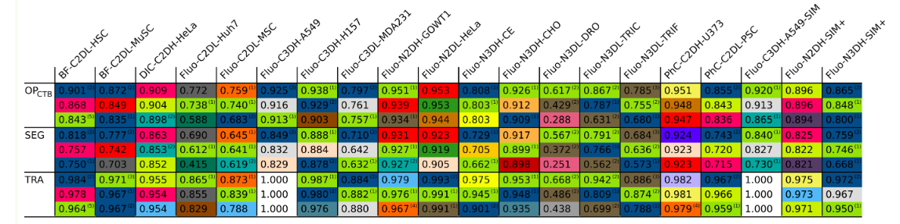

Fluo-C2DL-MSC    

- SEG score - 0.645 (2nd least) , TRA score - 0.873 (3rd least)
- Two sequences of 48 frames each
- **Very Low SNR and CR values**
- Shape of cells is very irregular (very different from circular) due to **long, thin extensions** which also cause the cell boundaries to be very vague (not well defined). Thus, **segmentation is difficult**.
- Shape of cells changes significantly even within consecutive frames.

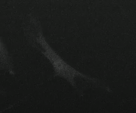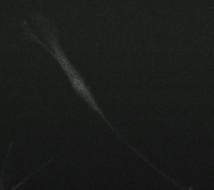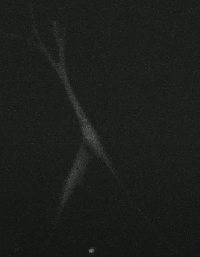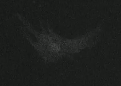

- Significant fading is present as intensity in some of the cells is higher than others

- Cells move fast causing **low overlaps between cells of consecutive frames** thus **tracking is difficult**
- No cell divisions are present.

Fluo-C2DL-huh7

1. SEG score - 0.690 (3rd least) , TRA score - 0.865 (2nd least)
1. Two sequences of 30 frames each.
1. **SNR and CR values are much higher** than C2DL-MSC dataset.
1. Cluster of cells are present.
1. **Sequence 01 :**
- Very **less movement** in cells between consecutive frames so tracking score is low maybe due to the presence of **clusters of cells**.
- Most of the cells have a regular (circular-like) shape.
- **Intra-cellular heterogeneity** is present so cell over-segmentation may occur thus, SEG score is low.
  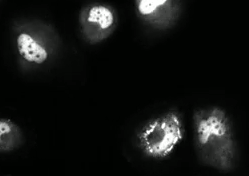
- Cell divisions are present

1. **Sequence 02**:
- Most of the cells have very little movement between consecutive frames. But very few cells have fast movement so tracking these will be more difficult than others.
- Intra-cellular heterogeneity is present.
- Cell divisions are present.
- One of the cells undergoes very rapid shape variations unlike the other cells.
  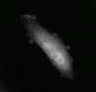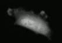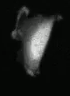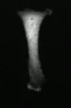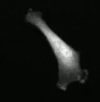

